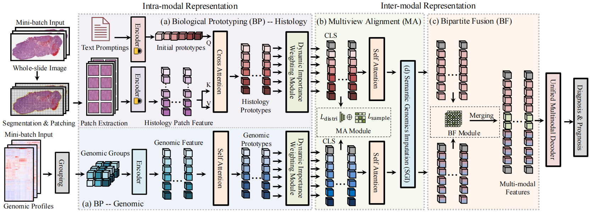

<h1 align="center">
Interpretable Multimodal Cancer Prototyping<br>
with Whole-Slide Images and Incompletely Paired Genomics
</h1>

<p align="center">
  
</p>

## Installation

### a. Create a conda environment

```bash
# Create a conda environment
conda create -n IMP python=3.10

# Activate the environment
conda activate IMP
```
### b. Install PyTorch and torchvision following the official instructions
```bash
conda install pytorch=1.13.0 torchvision=0.14.0 torchaudio=0.13.0 pytorch-cuda=11.7 -c pytorch -c nvidia
```
### c. Install this repository
```bash
# Enter the project directory
cd IMP/

# Install dependencies
pip install -r requirements.txt

# Install in development mode (no need to reinstall after code changes)
python setup.py develop
```

## Training (Survival Analysis)

Training is performed via a SLURM job script.

### Submit the training job

Run the following command to submit the survival training job:

```bash
sbatch train_survival.sh
```
